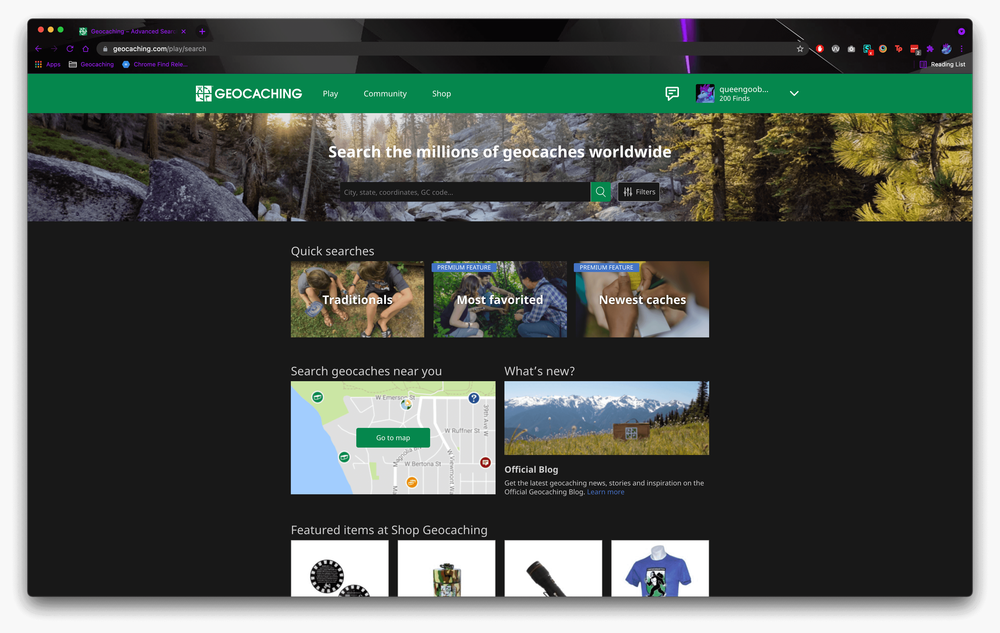
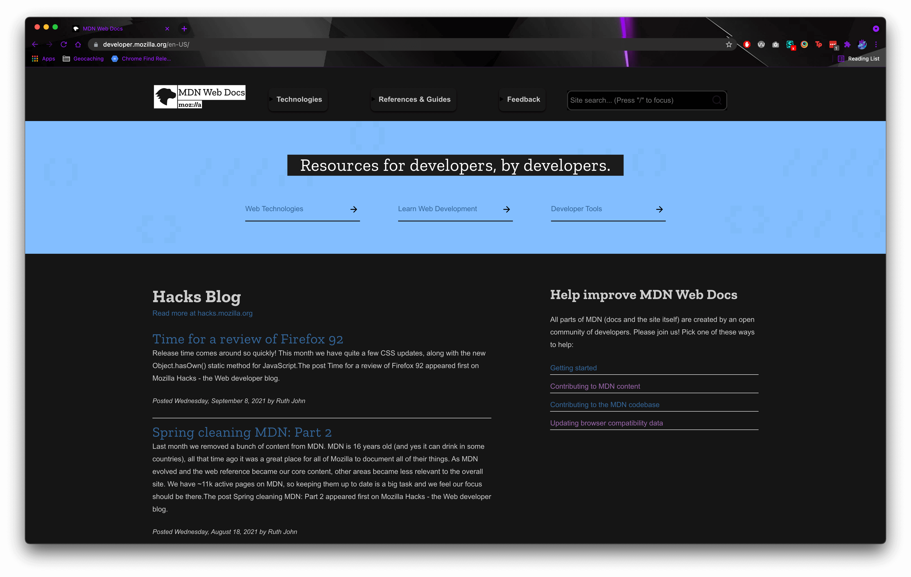
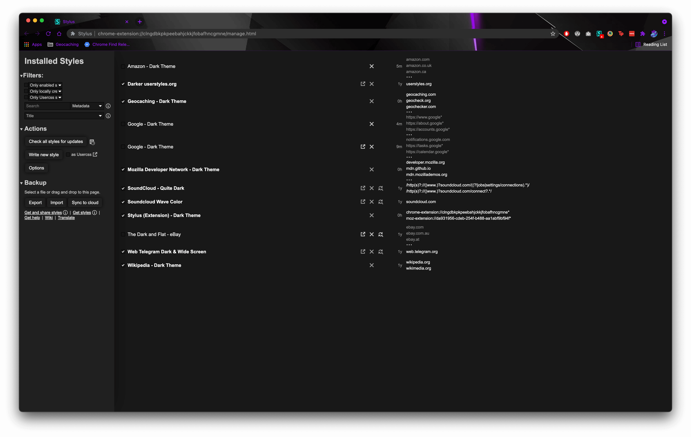
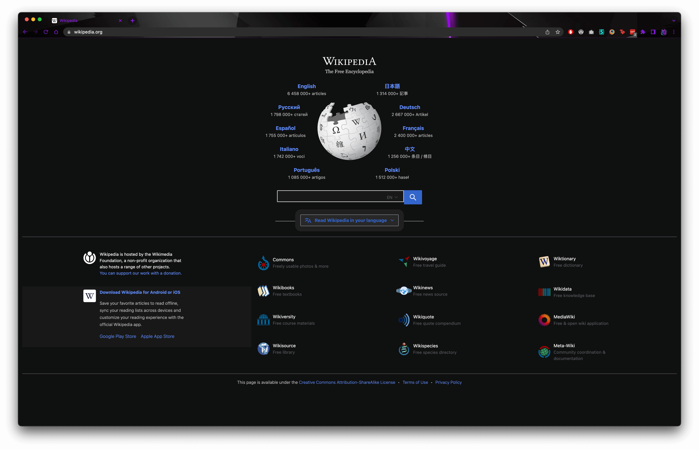

# Vinyl's Dark Themes

This repository contains the custom CSS to apply dark themes to various websites yet without one.  In each style, all colors are adjustable via variables that are set on `:root`.

## Issues/Requests

Found a styling issue?  Want me to add a new site?  Feel free to let me know by [opening an issue](https://github.com/queengooborg/darkthemes/issues/new), or create a pull request if you want to fix it yourself!

## Available Themes

### Geocaching
A dark theme for the Geocaching.com website, as well as a few other related websites (GeoCheck.org, GeoChecker.com, Certitudes.org, and PathTags.com).

### Mozilla Developer Network
**This style is now deprecated, as MDN has a built-in dark theme!**

A dark theme for the MDN web docs pages (developer.mozilla.org), updated for compatibility with their new [`Yari`](https://github.com/mdn/yari) layout engine.

### Stylus (Extension)
A dark theme for the Stylus extension, compatible with Chrome/Edge, Opera, and Firefox editions.

### Wikipedia
A dark theme for [Wikipedia](https://wikipedia.org) and [Wikimedia](https://wikimedia.org).

